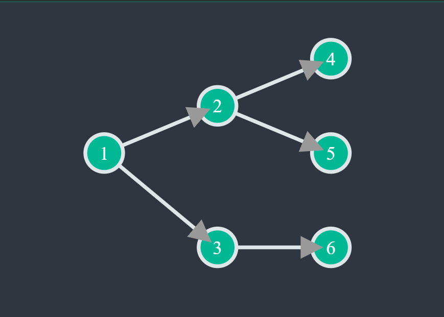
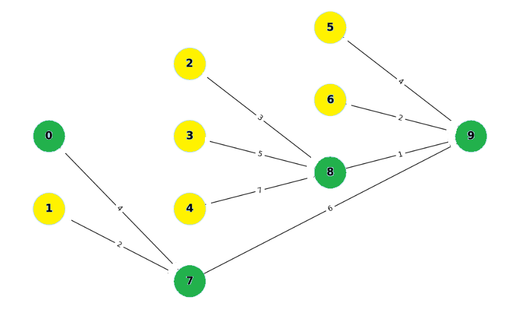

# Scheduling Algorithms

The scheduling algorithms covered and to be implemented are:

1. Earliest Deadline First (EDF) for Single-Node
2. Latest Deadline First (LDF) for Single-Node
3. Earliest Deadline First (EDF) for Multi-Node.
4. Latest Deadline First (LDF) for Multi-Node
5. Least Laxity (LL) for Multi-Node

## Application Model

shift everything here and also describe deadliune , wcet and stuff



The application model is illustrated as a Directed Acyclic Graph (DAG), highlighting the tasks and their dependencies. Nodes within the DAG represent individual tasks, each annotated with attributes such as deadlines and execution times. Directed edges between nodes depict the dependency relationships among tasks, signifying that a task can only commence once all its prerequisite tasks (predecessors) have been completed.

## Platform Model


The platform model showcases a single computational node responsible for executing the scheduled operations. Within this model, the node's scheduling decisions are guided by task deadlines to ensure that tasks with the nearest deadlines are given priority. The platform model emphasizes sequential task execution on the single computational node, maintaining adherence to the task dependencies defined in the application model.

## JSON Input

we describe the json input for the figure above.
The input to the scheduling algorithms is a JSON object that describes the application and platform models. The application model includes tasks and messages, while the platform model includes nodes and links. The JSON input contains following objects and should conform to the [input JSON schema](README.md#api-input-schema-for-schedule-jobs).

- **Tasks**: Represent the tasks to be scheduled.
- **Messages**: Represent dependencies between tasks.
- **Nodes**: Represent the either a compute node where tasks can be executed or router in the network or a sensor or a actuators.
- **Links**: Represent the communication links between nodes.

``` json

    {
        "application": {
        "tasks": [
            {
            "id": 0,
            "wcet": 20,
            "mcet": 10,
            "deadline": 250
            },
            {
            "id": 1,
            "wcet": 20,
            "mcet": 10,
            "deadline": 250
            },
            {
            "id": 2,
            "wcet": 20,
            "mcet": 10,
            "deadline": 300
            
            },
            {
            "id": 3,
            "wcet": 20,
            "mcet": 10,
            "deadline": 256
        
            }
        ],
        "messages": [
            {
            "id": 0,
            "sender": 1,
            "receiver": 0,
            "size": 40
            },
            {
            "id": 1,
            "sender": 2,
            "receiver": 1,
            "size": 40
            },
            {
            "id": 2,
            "sender": 3,
            "receiver": 1,
            "size": 40
            }
        ]
        },
        "platform": {
        "nodes": [
            {
            "id": 0,
            "type": "router"
            },
            {
            "id": 1,
            "type": "compute"
            },
            {
            "id": 2,
            "type": "compute"
            },
            {
            "id": 3,
            "type": "compute"
            },
            {
            "id": 4,
            "type": "compute"
            },
            {
            "id": 5,
            "type": "compute"
            },
            {
            "id": 6,
            "type": "compute"
            },
            {
            "id": 7,
            "type": "router"
            },
            {
            "id": 8,
            "type": "router"
            },
            {
            "id": 9,
            "type": "router"
            }
        ],
        "links": [
            {
            "id":0,
            "start_node": 0,
            "end_node": 7,
            "link_delay": 4,
            "bandwidth":200,
            "type": "ethernet"
            },
            {
                "id":1,
            "start_node": 1,
            "end_node": 7,
            "link_delay": 2,
            "bandwidth":200,
            "type": "ethernet"
            },
            {
                "id":2,
            "start_node": 7,
            "end_node": 8,
            "link_delay": 8,
            "bandwidth":200,
            "type": "ethernet"
            },
            {
                "id":3,
            "start_node": 2,
            "end_node": 8,
            "link_delay": 3,
            "bandwidth":200,
            "type": "ethernet"
            },
            {
                "id":4,
            "start_node": 3,
            "end_node": 8,
            "link_delay": 5,
            "bandwidth":200,
            "type": "ethernet"
            },
            {
                "id":5,
            "start_node": 4,
            "end_node": 8,
            "link_delay": 7,
            "bandwidth":200,
            "type": "wired"
            },
            {
                "id":6,
            "start_node": 8,
            "end_node": 9,
            "link_delay": 6,
            "bandwidth":200,
            "type": "wired"
            },
            {
                "id":7,
            "start_node": 7,
            "end_node": 9,
            "link_delay": 1,
            "bandwidth":200,
            "type": "ethernet"
            },
            {
                "id":8,
            "start_node": 5,
            "end_node": 9,
            "link_delay": 4,
            "bandwidth":200,
            "type": "ethernet"
            },
            {
                "id":9,
            "start_node": 6,
            "end_node": 9,
            "link_delay": 2,
            "bandwidth":200,
            "type": "ethernet"
            }
        ]
        }
    }
```

## Earliest Deadline First (EDF) for Single Node

The Earliest Deadline First (EDF) algorithm is used to schedule tasks on a single computational node by prioritizing tasks based on their deadlines. The primary objective is to ensure tasks with the nearest deadlines are executed first, optimizing the schedule to meet critical time constraints and minimizing the risk of missed deadlines.

### Scheduling Mechanism

#### Initialization

- The process begins with the identification and representation of all tasks and their dependencies within the Directed Acyclic Graph (DAG). Initial tasks, which have no dependencies (root nodes), are identified and marked as ready for scheduling.

#### Selection of Tasks

- Among the tasks that are ready for execution, the task with the earliest deadline is selected. This task is prioritized to ensure that the most time-sensitive operations are addressed first.

#### Task Execution

- The selected task is then scheduled on the computational node. The start time is determined based on the node's availability, and the task is executed for a duration corresponding to its WCET. The end time is calculated and recorded.

#### Dependency Resolution

- Upon the completion of a task, the scheduler evaluates its dependent tasks. If all dependencies of a subsequent task are resolved (i.e., all predecessor tasks are completed), this task becomes eligible for scheduling.

#### Iterative Scheduling

- The scheduling process iterates through the available tasks, continuously selecting and scheduling tasks based on their deadlines. The system dynamically updates the status of tasks and their dependencies, ensuring that at each step, the task with the nearest deadline is chosen.

#### Handling Deadline Misses

- If a task's execution is anticipated to exceed its deadline, it is marked as a missed deadline. The scheduler records such instances and evaluates the impact on subsequent tasks. Efforts are made to minimize the cascading effects of missed deadlines on the overall schedule.

#### Final Schedule Compilation

- At the conclusion of the scheduling process, a comprehensive schedule is compiled. This includes detailed records of task start and end times, deadlines, and any instances of missed deadlines. The final schedule provides a clear overview of task execution and node utilization.

#### Example

Let's understand EDF scheduling for a single node using the Example above: 

``` json
{
    "schedule": [
          {
                "task_id": 3,
                "node_id": 0,
                "end_time": 20,
                "deadline": 256,
                "start_time": 0,
                "execution_time": 20
            },
            {
                "task_id": 2,
                "node_id": 0,
                "end_time": 40,
                "deadline": 300,
                "start_time": 20,
                "execution_time": 20
            },
            {
                "task_id": 1,
                "node_id": 0,
                "end_time": 60,
                "deadline": 250,
                "start_time": 40,
                "execution_time": 20
            },
            {
                "task_id": 0,
                "node_id": 0,
                "end_time": 80,
                "deadline": 250,
                "start_time": 60,
                "execution_time": 20
            }

    ]
}
```

Consider the application model described above. Analyzing the order of tasks:

- **Task 3** is executed first because it has no predecessors blocking its execution. It starts at time 0 and finishes at time 20, well ahead of its deadline of 256.
- **Task 2** is next in line, starting right after Task 3 at time 20 and finishing at time 40. It also meets its deadline of 300.
- **Task 1** is scheduled once Task 2 completes, beginning at time 40 and ending at time 60, just before its deadline of 250.
- **Task 0** is the last task to be scheduled. It starts at time 60 and finishes at time 80, meeting its deadline of 250.

## Latest Deadline First (LDF) for Single Node

The Latest Deadline First (LDF) scheduling algorithm for a single node prioritizes tasks based on their latest deadlines, ensuring that tasks with the furthest deadlines are scheduled first. This strategy allows for more flexibility in handling tasks with earlier deadlines.

### Scheduling Mechanism

#### Initialization

- The algorithm begins by identifying all tasks with no successors (leaf nodes) in the Directed Acyclic Graph (DAG). These tasks are initially added to the set of tasks that can be scheduled.

#### Selection of Tasks

- Among the tasks that can be scheduled, the task with the latest deadline is selected for execution. This ensures that tasks with the furthest deadlines are given priority.

#### Task Execution

- Once a task is selected, it is scheduled for execution on the single computational node. The start time is determined based on the completion time of the previously scheduled task, ensuring no overlap.

#### Dependency Management

- After scheduling a task, the algorithm updates the set of tasks that can be scheduled next. This involves checking the predecessors of the currently scheduled task. If all successors of a predecessor task have been scheduled, the predecessor task becomes eligible for scheduling.

#### Iterative Scheduling

- The scheduling process iterates through the available tasks, continuously selecting and scheduling tasks based on their latest deadlines. The system dynamically updates the status of tasks and their dependencies, ensuring that at each step, the task with the latest deadline is chosen.

#### Handling Task Completion and Deadlines

- The end time of each task is calculated based on its Worst-Case Execution Time (WCET). If a task's completion time exceeds its deadline, it is marked as a missed deadline. The algorithm continues this process until all tasks are scheduled.

This method maximizes the utilization of available time before their deadlines, while allowing tasks with earlier deadlines to be handled with the flexibility provided by scheduling tasks with later deadlines first. The LDF algorithm is particularly useful in scenarios where tasks with later deadlines are more critical or have higher priority for completion.

#### Example

Consider the application model described by the DAG in Figure 1. Analyzing the order of tasks:

``` json
{
    "schedule": [
            {
                "task_id": 3,
                "node_id": 0,
                "end_time": 20,
                "deadline": 256,
                "start_time": 0,
                "execution_time": 20
            },
            {
                "task_id": 2,
                "node_id": 0,
                "end_time": 40,
                "deadline": 300,
                "start_time": 20,
                "execution_time": 20
            },
            {
                "task_id": 1,
                "node_id": 0,
                "end_time": 60,
                "deadline": 250,
                "start_time": 40,
                "execution_time": 20
            },
            {
                "task_id": 0,
                "node_id": 0,
                "end_time": 80,
                "deadline": 250,
                "start_time": 60,
                "execution_time": 20
            }

    ]
}
```

- **Task 3** is executed first because it has no predecessors blocking its execution. It starts at time 0 and finishes at time 20, well ahead of its deadline of 256.
- **Task 2** is next in line, starting right after Task 3 at time 20 and finishing at time 40. It also meets its deadline of 300.
- **Task 1** is scheduled once Task 2 completes, beginning at time 40 and ending at time 60, just before its deadline of 250.
- **Task 0** is the last task to be scheduled. It starts at time 60 and finishes at time 80, meeting its deadline of 250.

## Earliest Deadline First (EDF) Multi-Node 

The **Earliest Deadline First (EDF) Multi-Node (Without Communication Delay)** algorithm is an extension of the EDF strategy applied to a multi-node environment. In this variant, tasks are scheduled across multiple computational nodes, prioritizing those with the earliest deadlines, while assuming that there is no communication delay between nodes. This simplifies the scheduling process, where task execution time and node availability are the primary factors considered.

### Scheduling Mechanism

#### Initialization

- **Identify Root Tasks:** The algorithm begins by identifying tasks with no dependencies (root tasks) and schedules them for execution on available nodes immediately.

#### Node Selection

- Tasks are assigned to computational nodes based on their availability, prioritizing the earliest available node for execution.

#### Task Distribution and Execution

- Once root tasks are completed, their dependent tasks are checked. Among these, the task with the earliest deadline is selected for execution.
- Tasks are scheduled on nodes based on the earliest available time, allowing independent tasks to execute concurrently across nodes.

#### Managing Dependencies

- The algorithm continuously monitors dependencies between tasks, only allowing a task to be scheduled once all its predecessors have finished executing.
- Task dependencies are respected, and the availability of a task for scheduling is updated dynamically as the schedule progresses.

#### Handling Concurrent Execution

- Multiple tasks that are independent of each other can be scheduled for execution concurrently on different nodes, taking advantage of parallel processing capabilities.
- This concurrent execution improves scheduling efficiency and increases the likelihood of meeting task deadlines.

#### Scheduling and Deadline Management

- The start time of each task is determined by the completion time of its preceding tasks, along with the availability of the node.
- Task end times are calculated using the Worst-Case Execution Time (WCET) of the task. If a task's end time exceeds its deadline, it is flagged as a missed deadline.
- By consistently prioritizing tasks with the earliest deadlines, the algorithm seeks to minimize missed deadlines.

### Example

Consider an example of scheduling tasks on a multi-node platform using EDF without communication delay.

```json
{
        "schedule": [
            {
                "task_id": 3,
                "node_id": 1,
                "end_time": 20,
                "deadline": 256,
                "start_time": 0,
                "execution_time": 20
            },
            {
                "task_id": 2,
                "node_id": 2,
                "end_time": 20,
                "deadline": 300,
                "start_time": 0,
                "execution_time": 20
            },
            {
                "task_id": 1,
                "node_id": 3,
                "end_time": 40,
                "deadline": 250,
                "start_time": 20,
                "execution_time": 20
            },
            {
                "task_id": 0,
                "node_id": 4,
                "end_time": 60,
                "deadline": 250,
                "start_time": 40,
                "execution_time": 20
            }
        ]
    }

```


- **Task 3** is executed first on Node 1. It starts at time 0 and completes by time 20, meeting its deadline of 256.
- **Task 2** runs simultaneously on Node 2. It begins at time 0 and finishes at time 20, well within its deadline of 300.
- **Task 1** is scheduled on Node 3, starting at time 20 and ending at time 40. It meets its deadline of 250.
- Finally, **Tasks 0** is assigned to Node 4, starting at time 40 and concluding at time 60. It successfully meets its deadline of 250.

## Latest Deadline First (LDF) Multi-Node 

The **Latest Deadline First (LDF) Multi-Node (Without Communication Delay)** algorithm schedules tasks based on the latest possible deadlines in a multi-node environment. Unlike EDF, which prioritizes the earliest deadlines, LDF selects tasks that can afford to be scheduled later while still meeting their deadlines. In this variant, no communication delay between nodes is considered, simplifying the scheduling process.

### Scheduling Mechanism

#### Initialization

- **Identify Leaf Tasks:** The algorithm begins by identifying tasks with no successors (leaf tasks). These tasks are selected first for scheduling.
- **Task Selection:** The tasks with the latest deadlines are prioritized for scheduling first, enabling other tasks with earlier deadlines to wait as long as possible.

#### Node Selection

- Tasks are assigned to computational nodes based on their availability, ensuring that the latest-deadline tasks are scheduled on the first available node.

#### Task Distribution and Execution

- Once leaf tasks are scheduled, the algorithm checks their predecessors. Among the predecessors whose successors have all been completed, the one with the latest deadline is selected for scheduling.
- Tasks are distributed across nodes based on the earliest available time, taking advantage of concurrent execution when possible.

#### Managing Dependencies

- The algorithm continuously monitors task dependencies, ensuring that a task can only be scheduled when all its successors have been executed.
- Predecessor tasks are dynamically added to the schedulable pool as their successors finish execution.

#### Handling Concurrent Execution

- Tasks that are independent of each other can execute concurrently across different nodes, utilizing multi-node parallelism to increase efficiency.
- Parallel execution ensures that more tasks are able to meet their deadlines by taking advantage of idle nodes.

#### Scheduling and Deadline Management

- The start time of each task depends on the completion time of its predecessors, combined with the availability of the assigned node.
- The task's end time is determined by its Worst-Case Execution Time (WCET). If the task exceeds its deadline, it is flagged as a missed deadline, and subsequent dependent tasks are removed from the schedule to prevent further violations.
- By selecting tasks with the latest deadlines, the algorithm delays task execution as much as possible while aiming to avoid missing deadlines.

### Example

Let's explore an example of scheduling tasks on a multi-node platform using LDF without communication delay.

```json
    {
    "schedule": [
        {
        "task_id": 0,
        "node_id": 1,
        "end_time": 20,
        "deadline": 250,
        "start_time": 0,
        "execution_time": 20
        },
        {
        "task_id": 1,
        "node_id": 2,
        "end_time": 40,
        "deadline": 300,
        "start_time": 20,
        "execution_time": 20
        },
        {
        "task_id": 2,
        "node_id": 3,
        "end_time": 40,
        "deadline": 256,
        "start_time": 20,
        "execution_time": 20
        },
        {
        "task_id": 3,
        "node_id": 4,
        "end_time": 60,
        "deadline": 350,
        "start_time": 40,
        "execution_time": 20
        }
    ]
    }
```
- **Task 3** is executed first on Node 1. It starts at time 0 and completes by time 20, meeting its deadline of 256.
- **Task 2** runs simultaneously on Node 2. It begins at time 0 and finishes at time 20, well within its deadline of 300.
- **Task 1** is scheduled on Node 3, starting at time 20 and ending at time 40. It meets its deadline of 250.
- Finally, **Tasks 0** is assigned to Node 4, starting at time 40 and concluding at time 60. It successfully meets its deadline of 250.

## Least Laxity First (LLF) Multi-Node 

The Least Laxity First (LLF) scheduling algorithm for multi-node environments prioritizes tasks based on their laxity, which is the difference between the task’s deadline and the time remaining to complete its execution. LLF aims to minimize the likelihood of missed deadlines by executing tasks with the least laxity first. This version assumes no communication delays between the nodes.

### Scheduling Mechanism

#### Initial Task Scheduling

1. **Identify Root Tasks:**
   - The algorithm starts by identifying tasks with no unsatisfied dependencies (root nodes) that can be scheduled immediately.
   - Root tasks are added to the schedulable set since they do not depend on other tasks in the directed acyclic graph (DAG).

2. **Calculate Laxity:**
   - Compute the laxity of each root task based on the current time, deadline, and worst-case execution time (WCET).
   - The laxity \( L_i \) for task \( i \) is calculated as:
   \[
   L_i = \text{deadline}_i - (\text{current time} + \text{WCET}_i)
   \]

#### Task Distribution and Execution

3. **Select Task with Least Laxity:**
   - Among the set of schedulable tasks, select the task with the smallest laxity value, denoted as \( \text{task}_\text{min} \).

4. **Assign Task to Node:**
   - Allocate \( \text{task}_\text{min} \) to the node that becomes available first. This ensures tasks are scheduled on nodes as soon as possible to meet deadlines.

5. **Update Node Availability:**
   - Once \( \text{task}_\text{min} \) is scheduled, update the availability of the assigned node by adding the execution time of the task to the current time.
   - The new availability time for the node is calculated as:
   \[
   \text{Node}_\text{avail} = \text{current time} + \text{WCET}_\text{min}
   \]

#### Managing Dependencies

6. **Handle Task Dependencies:**
   - Once a task is completed, the algorithm checks the readiness of its dependent tasks.
   - A dependent task can only be scheduled once all its predecessor tasks have finished executing.

#### Deadline Management

7. **Monitor Deadlines:**
   - Continuously monitor task execution to ensure deadlines are met.
   - If a task’s completion time exceeds its deadline, it is marked as a missed deadline, and future scheduling decisions are adjusted accordingly.

#### Example

Let’s look at an example of LLF scheduling in a multi-node environment.

```json
     {
        "schedule": [
            {
                "task_id": 3,
                "node_id": 1,
                "end_time": 20,
                "deadline": 256,
                "start_time": 0,
                "execution_time": 20
            },
            {
                "task_id": 2,
                "node_id": 2,
                "end_time": 20,
                "deadline": 300,
                "start_time": 0,
                "execution_time": 20
            },
            {
                "task_id": 1,
                "node_id": 3,
                "end_time": 40,
                "deadline": 250,
                "start_time": 20,
                "execution_time": 20
            },
            {
                "task_id": 0,
                "node_id": 4,
                "end_time": 60,
                "deadline": 250,
                "start_time": 40,
                "execution_time": 20
            }
        ]
    }
```
- **Task 3** is executed first on Node 1. It starts at time 0 and completes by time 20, meeting its deadline of 256.
- **Task 2** runs simultaneously on Node 2. It begins at time 0 and finishes at time 20, well within its deadline of 300.
- **Task 1** is scheduled on Node 3, starting at time 20 and ending at time 40. It meets its deadline of 250.
- Finally, **Tasks 0** is assigned to Node 4, starting at time 40 and concluding at time 60. It successfully meets its deadline of 250.

